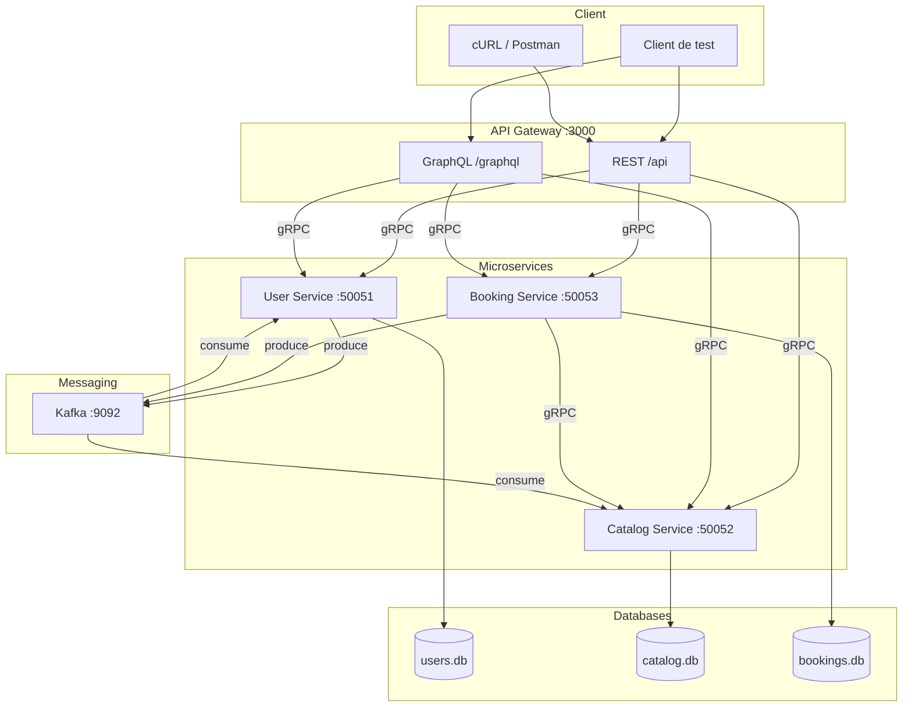

# Architecture — SmartReserve

## Vue d'ensemble

SmartReserve est une plateforme de réservation intelligente basée sur une architecture microservices. Elle permet aux utilisateurs de réserver des ressources (salles, studios, véhicules, bureaux) de manière décentralisée.

## Composants

### 1. API Gateway (port 3000)

Point d'entrée unique de l'application.

| Responsabilité | Détail |
|----------------|--------|
| REST | CRUD utilisateurs, ressources, réservations |
| GraphQL | Requêtes flexibles avec jointures (booking + user + resource) |
| Routage | Transmet les requêtes aux microservices via **gRPC** |
| Logique métier | **Aucune** — délégation totale aux microservices |

### 2. User Service (port 50051)

| Élément | Détail |
|---------|--------|
| Rôle | Gestion des utilisateurs (inscription, profil, recherche) |
| Interface | gRPC (`UserService`) |
| Base de données | SQLite3 — `users.db` |
| Kafka producteur | `user.registered` |
| Kafka consommateur | `booking.confirmed` (notification) |

### 3. Catalog Service (port 50052)

| Élément | Détail |
|---------|--------|
| Rôle | Catalogue de ressources réservables |
| Interface | gRPC (`CatalogService`) |
| Base de données | SQLite3 — `catalog.db` |
| Kafka consommateur | `booking.created`, `booking.cancelled` |

### 4. Booking Service (port 50053)

| Élément | Détail |
|---------|--------|
| Rôle | Gestion du cycle de vie des réservations |
| Interface | gRPC (`BookingService`) |
| Base de données | SQLite3 — `bookings.db` |
| Kafka producteur | `booking.created`, `booking.confirmed`, `booking.cancelled` |
| gRPC client | Appelle Catalog Service pour vérifier disponibilité et prix |

### 5. Kafka Broker (port 9092)

Communication asynchrone et découplée entre microservices.

## Flux de communication

### Flux synchrone (gRPC)

```
Client → API Gateway → [gRPC] → Microservice → SQLite
```

### Flux asynchrone (Kafka)

```
Booking Service ──booking.created──► Catalog Service (↓ disponibilité)
Booking Service ──booking.confirmed─► User Service (notification)
Booking Service ──booking.cancelled─► Catalog Service (↑ disponibilité)
User Service ─────user.registered───► (événement d'inscription)
```

## Schéma d'architecture



## Séparation des responsabilités

| Principe | Application |
|----------|-------------|
| Database per service | Chaque microservice possède sa propre base SQLite |
| Contrat d'interface | Fichiers `.proto` dans `/proto` |
| Découplage | Kafka pour les événements métier |
| Gateway léger | Pas de logique métier dans l'API Gateway |

## Ports utilisés

| Service | Port |
|---------|------|
| API Gateway | 3000 |
| User Service (gRPC) | 50051 |
| Catalog Service (gRPC) | 50052 |
| Booking Service (gRPC) | 50053 |
| Kafka | 9092 |
| Zookeeper | 2181 |

## Justification des protocoles

| Protocole | Usage | Justification |
|-----------|-------|---------------|
| **REST** | CRUD classique | Simple, standard, facilement testable avec cURL |
| **GraphQL** | Requêtes composées | Permet de récupérer booking + user + resource en une requête |
| **gRPC** | Gateway ↔ Microservices | Performance, typage fort via Protobuf, contrat formalisé |
| **Kafka** | Événements métier | Découplage async (disponibilité, notifications) |
